# ksqlDB Workshop — Getting Started with Streaming SQL
## Agendar
- Overview
- How ksqlDB work with Kafka
- Way to interact with ksqlDB
- Basic standing concept on ksqlDB
- ksqlDB Data pipeline
- Operations & Monitoring

## Overview
ksqlDB is a database for building stream processing applications on top of Apache Kafka. It is **distributed**, **scalable**, **reliable**, and **real-time**. ksqlDB combines the power of real-time stream processing with the approachable feel of a relational database through a familiar, lightweight SQL syntax.
<p align="center">
  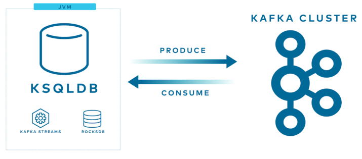
</p>

---

## How ksqlDB work with Kafka
ksqlDB separates its distributed compute layer from its distributed storage layer, for which it uses Apache Kafka.
<p align="center">
  
  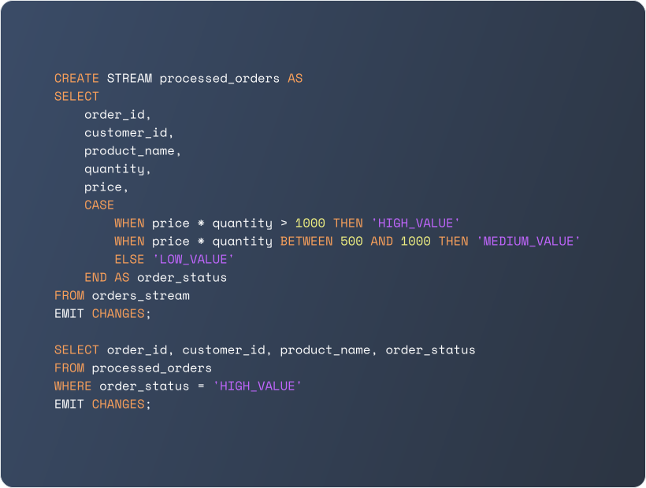
</p>

<p align="center"> <small><em> ksqlDB allows us to read, filter, transform, or otherwise process streams and tables of events, which are backed by Kafka topics. We can also join streams and/or tables to meet the needs of our application. And we can do all of this using familiar SQL syntax.
 </em></small> </p>

---

## Way to interact with ksqlDB

ksqlDB provides three main ways to interact with the system and execute SQL commands via ksqlDB-CLI, REST API, Confluent Control Center.
<p align="center">
  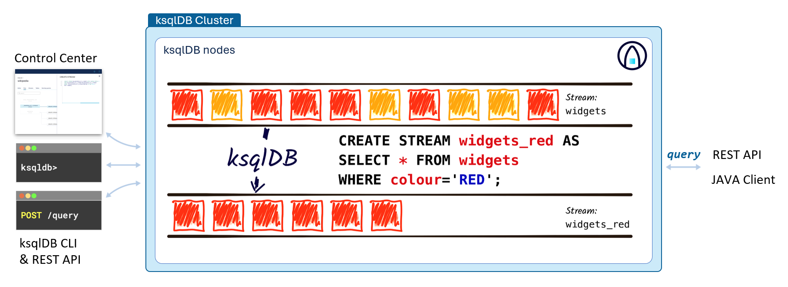
</p>

1. ksqlDB CLI  
   Use the command-line interface to run SQL commands directly and interactively.
   
<p align="center">
  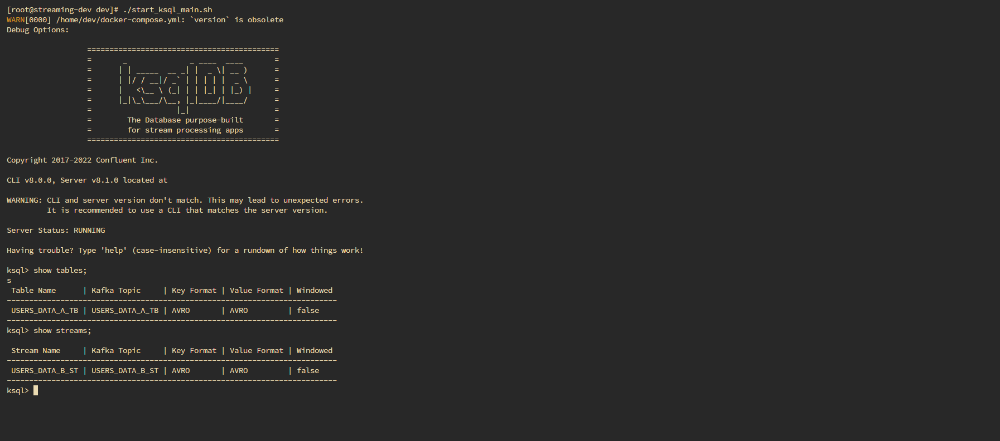
</p>

2. REST API  
   Send SQL statements and manage queries programmatically through HTTP endpoints.

<p align="center">
  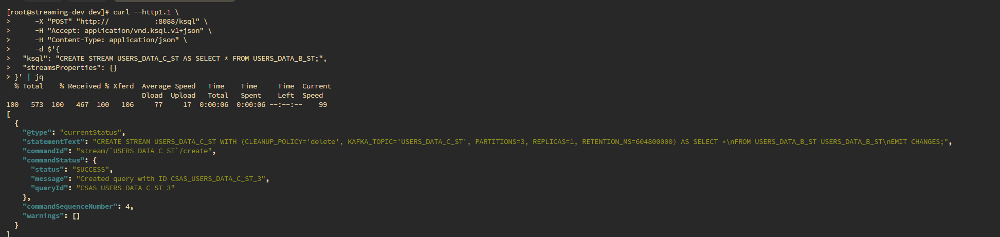
</p>

3. Confluent Control Center  
   Execute SQL commands and monitor queries through the web-based user interface.

<p align="center">
  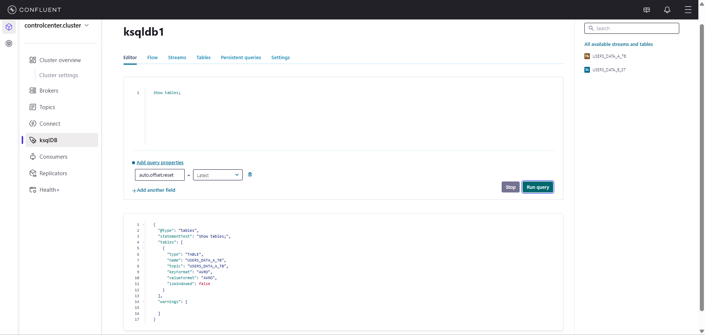
</p>

<p align="center"> <small><em> ksqlDB allows us to read, filter, transform, or otherwise process streams and tables of events, which are backed by Kafka topics. We can also join streams and/or tables to meet the needs of our application. And we can do all of this using familiar SQL syntax.
 </em></small> </p>

---

## Basic standing concept on ksqlDB
### Stream and Table
**Stream** is a partitioned, immutable, append-only collection that represents a series of historical facts. Once a row is inserted into a stream, it can never change. New rows can be appended at the end of the stream, **but existing rows can never be updated or deleted**.

**Table** is a mutable, partitioned collection that models change over time. In contrast with a stream, which represents a historical sequence of events, a table represents what is true as of **“now”**. 

<p align="center">
  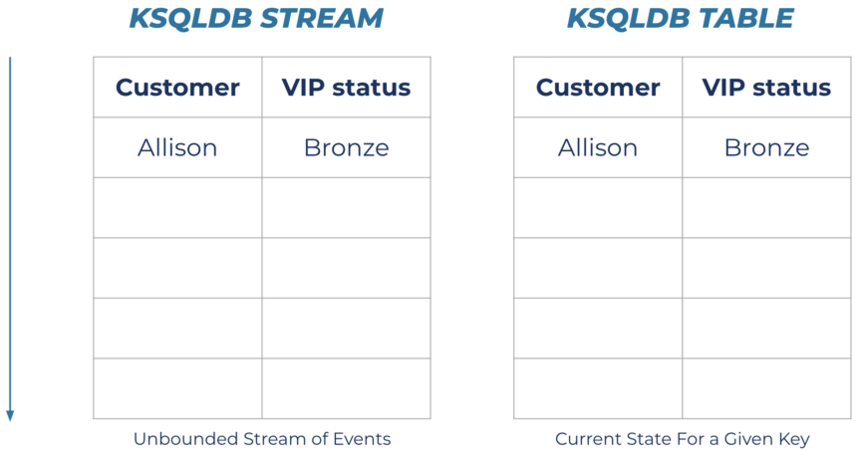
</p>

&nbsp;


### Materialized views (Stateful)
You can use ksqlDB to build a materialized view of state on a specific server by using RocksDB, driven by the events in an Apache Kafka topic. This is done using SQL aggregation functions, such as `COUNT` and `SUM`.
<p align="center">
  
</p>

---

## ksqlDB Data pipeline
### Overview Data pipeline

Diagram

**Pipeline 1**: Transformation & Filtering  
Transform raw data into structured format and filter invalid records.

**Pipeline 2**: Enrichment (Stream–Stream, Stream–Table, Table–Table Join)  
Join transaction data with account data to add business context.

**Pipeline 3**: Aggregation & Window Time (Tumbling, Hopping, Session Window)  
Aggregate data within time windows for real-time analytics.

---

### Pipeline 1: Transformation, filtering, Aggregate
#### Step 1 Create source stream
```sql
CREATE STREAM CDC_MF_TXN_RAW_ST (
    raw_message VARCHAR  -- Defines the structure of incoming raw messages
) WITH (
    KAFKA_TOPIC = 'CDC_MF_TXN',   -- Source Kafka topic
    VALUE_FORMAT = 'KAFKA',              -- Raw Kafka message format
    PARTITIONS = 3,                      -- Number of partitions for scalability
    REPLICAS = 1                         -- Replication factor for fault tolerance
);
```

#### Output:

<p align="center">
  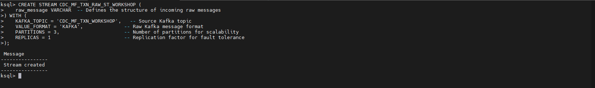
</p>

---

#### Step 2 Transform Data
```sql
CREATE STREAM CDC_MF_TXN_STG_ST
WITH (
    KAFKA_TOPIC = 'CDC_MF_TXN_STG_ST',   -- Source Kafka topic
    VALUE_FORMAT = 'JSON',               -- JSON message format
    PARTITIONS = 3,                      -- Number of partitions for scalability
    REPLICAS = 1                         -- Replication factor for fault tolerance
) AS

SELECT
    -- Split raw message
    SPLIT(raw_message, '|') AS raw_fields,

    -- Transaction info
    SPLIT(raw_message, '|')[1] AS TXN_ID,
    SPLIT(raw_message, '|')[2] AS TXN_TYPE,
    SPLIT(raw_message, '|')[3] AS TXN_CODE,

    -- Amount
    CAST(SPLIT(raw_message, '|')[4] AS DOUBLE) AS TXN_AMT,

    -- Account & metadata
    SPLIT(raw_message, '|')[5] AS ACC_NO,
    SPLIT(raw_message, '|')[6] AS TXN_DT,
    SPLIT(raw_message, '|')[7] AS CHANNEL,
    SPLIT(raw_message, '|')[8] AS UPDATE_TS

FROM CDC_MF_TXN_RAW_ST
WHERE SPLIT(raw_message, '|')[1] NOT IN ('000000','999999') OR SPLIT(raw_message, '|')[7] != 'Mobile';
```

#### Output:

<p align="center">
  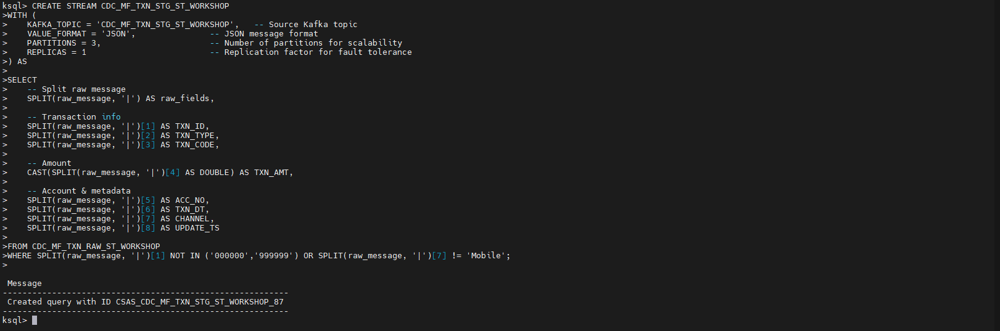
</p>
---

#### Step 3 Filtering Reject Condition
```sql
CREATE STREAM CDC_MF_TXN_STG_REJ_ST
WITH (
    KAFKA_TOPIC = 'CDC_MF_TXN_STG_REJ_ST',  -- Source Kafka topic
    VALUE_FORMAT = 'JSON',               -- JSON message format
    PARTITIONS = 3,                      -- Number of partitions for scalability
    REPLICAS = 1                         -- Replication factor for fault tolerance
) AS

SELECT
    -- Split raw message
    SPLIT(raw_message, '|') AS raw_fields,

    -- Transaction info
    SPLIT(raw_message, '|')[1] AS TXN_ID,
    SPLIT(raw_message, '|')[2] AS TXN_TYPE,
    SPLIT(raw_message, '|')[3] AS TXN_CODE,

    -- Amount
    CAST(SPLIT(raw_message, '|')[4] AS DOUBLE) AS TXN_AMT,

    -- Account & metadata
    SPLIT(raw_message, '|')[5] AS ACC_NO,
    MASK_KEEP_LEFT(SPLIT(raw_message, '|')[5], 4, 'X', 'x', 'n', '-') AS ACC_NO_MASK,
    SPLIT(raw_message, '|')[6] AS TXN_DT,
    SPLIT(raw_message, '|')[7] AS CHANNEL,
    SPLIT(raw_message, '|')[8] AS UPDATE_TS

FROM CDC_MF_TXN_RAW_ST
WHERE SPLIT(raw_message, '|')[7] = 'Mobile';
```

#### Output:
<p align="center">
  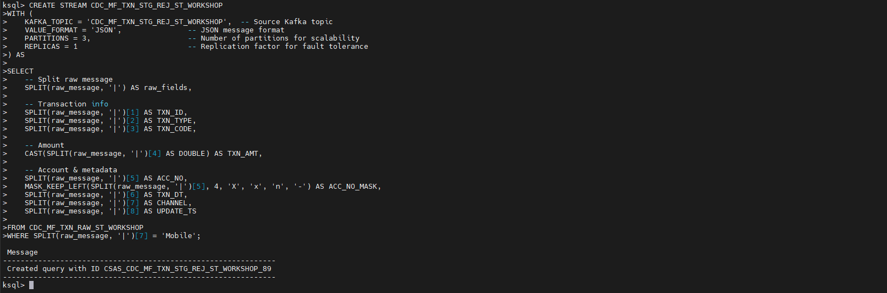
</p>

##### Note: After running the `CREATE STREAM` command, make sure that both the stream and the Kafka topic are created correctly.
<p align="center">
  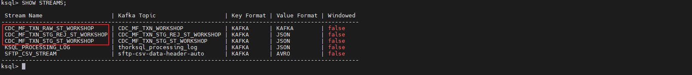
  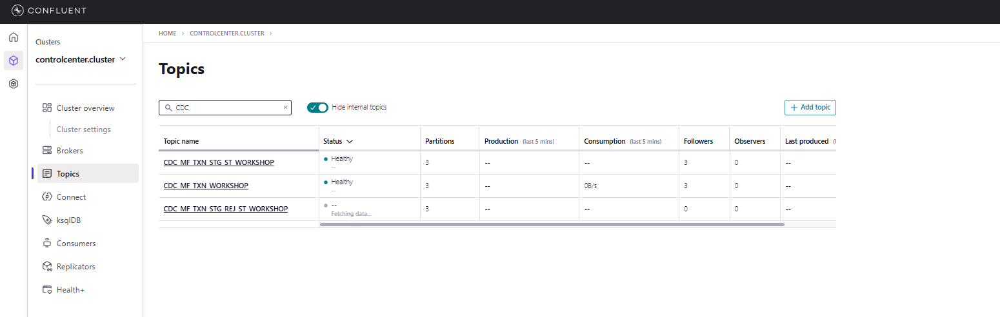
</p>


---

#### Step 4 Insert and Select Data

```sql
-- Scenario 1: Normal Transaction (ATM) -> Should go to STG
INSERT INTO CDC_MF_TXN_RAW_ST (raw_message) VALUES ('TXN1001|DEPOSIT|D01|5000.00|ACC001|2024-02-09 10:00:00|ATM|2024-02-09 10:00:05');

-- Scenario 2: Rejected Transaction (Restricted ID '000000' + Mobile) -> Should go ONLY to REJ (Filtered from STG)
INSERT INTO CDC_MF_TXN_RAW_ST (raw_message) VALUES ('000000|TEST|X00|0.00|ACC999|2024-02-09 10:10:00|Mobile|2024-02-09 10:10:05');
```

#### Output: Verify that normal transactions appear in the accepted stream and rejected transactions appear in the reject stream

- **TXN1001** is routed to `CDC_MF_TXN_STG_ST_WORKSHOP` because it uses a valid transaction ID and comes from a non-Mobile channel.
- **000000** is routed to `CDC_MF_TXN_STG_REJ_ST_WORKSHOP` because it uses a restricted ID and comes from the Mobile channel, which matches the rejection rules.


<p align="center">
  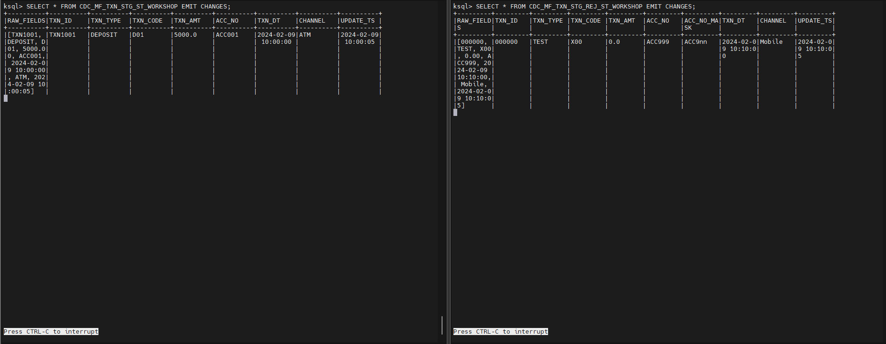
  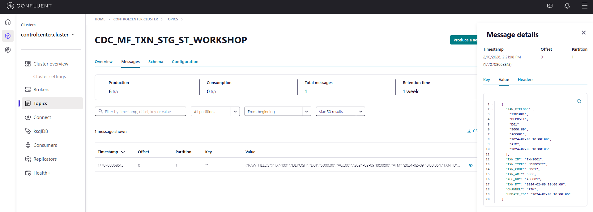
  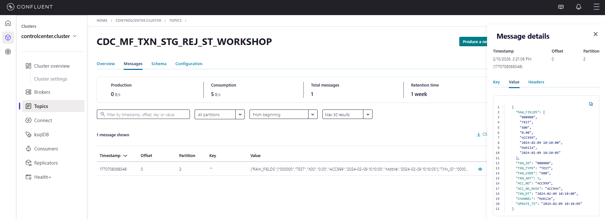
</p>
<p align="center"> <small><em> </em></small> </p>

<p align="center"> <small><em> You can verify that records are available in both the Kafka topic and the stream.
 </em></small> </p>

---

### Pipeline 2.1: Enrichment Stream with Stream 
#### Basic Join concept on ksqlDB
- **Stream and Stream**
  you must specify a windowing scheme by using the WITHIN clause. A new input record on one side produces a join output for each matching record on the other side, and there can be multiple such matching records within a join window.
- **Stream and Table**
  joins are always non-windowed joins. You can perform table lookups against a table when a new record arrives on the stream. Only events arriving on the stream side trigger downstream updates and produce join output. Updates on the table side don’t produce updated join output.
- **Table and Table**
  Joins the current/latest values from both tables using the same key.

<div align="center">
  
| Join Type      | Windowed?     | INNER Join | LEFT OUTER Join | RIGHT OUTER Join | FULL OUTER Join |
|----------------|---------------|------------|------------------|------------------|------------------|
| Stream-Stream  | Windowed      | Supported  | Supported        | Supported        | Supported        |
| Table-Table    | Non-windowed  | Supported  | Supported        | Supported        | Supported        |
| Stream-Table   | Non-windowed  | Supported  | Supported        | Not Supported    | Not Supported    |

  <small><em>
    Join Capabilities.
  </em></small>
</div>

#### Step 1 Create source Stream
```SQL
CREATE STREAM CDC_DB_MASTER_ACC_RAW_ST_<USER> (
  ACCOUNT_ID VARCHAR KEY,
  ACCOUNT_NAME VARCHAR,
  ACCOUNT_BALANCE DOUBLE,
  ACCOUNT_TYPE VARCHAR,
  UPDATE_TS TIMESTAMP,
  __OP STRING
) WITH (
  KAFKA_TOPIC = 'CDC_DB_MASTER_ACC_<USER>',  -- Source Kafka topic
  FORMAT = 'JSON',               -- JSON message format
  PARTITIONS = 3,                -- Number of partitions for scalability
  REPLICAS = 3                   -- Replication factor for fault tolerance
);
```

#### Output:

<p align="center">
  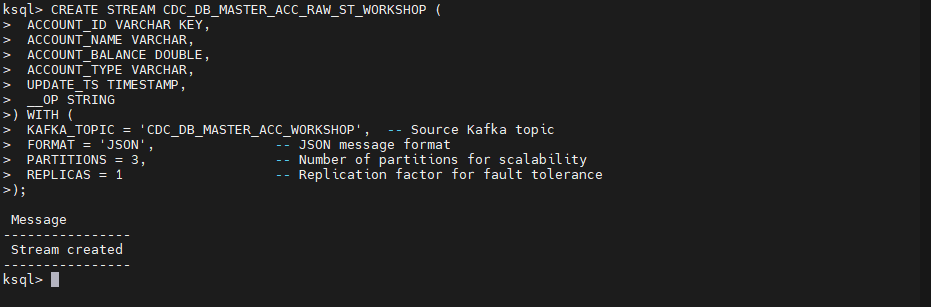
</p>
---

#### Step 2 Enrich Stream and Stream

```SQL
SET 'auto.offset.reset' = 'latest';  -- Ignore existing messages and read new data only

CREATE STREAM CDC_DB_MASTER_ACC_STG_JOIN_STREAM_STREAM_ST_<USER> WITH (
    KAFKA_TOPIC = 'CDC_DB_MASTER_ACC_STG_JOIN_STREAM_STREAM_<USER>', -- Source Kafka topic
    FORMAT = 'JSON',               -- JSON message format
    PARTITIONS = 3,                -- Number of partitions for scalability
    REPLICAS = 3                   -- Replication factor for fault tolerance
) AS 
SELECT 
    A.ACCOUNT_ID as ACCOUNT_ID,
    A.ACCOUNT_NAME as ACCOUNT_NAME,
    A.ACCOUNT_BALANCE as ACCOUNT_BALANCE,
    A.ACCOUNT_TYPE as ACCOUNT_TYPE,
    T.TXN_ID as TXN_ID,
    T.TXN_CODE as TXN_CODE,
    T.TXN_AMT as TXN_AMT,
    T.TXN_TYPE as TXN_TYPE,
    T.UPDATE_TS as TRANS_TS,
    A.UPDATE_TS as ACCOUNT_TS
FROM CDC_DB_MASTER_ACC_RAW_ST_<USER> A
INNER JOIN CDC_MF_TXN_STG_ST_<USER> T 
WITHIN 30 SECONDS  -- Define join window between two streams
ON A.ACCOUNT_ID = T.ACC_NO;
```

#### Output:
<p align="center">
  
</p>

##### Note: After running the `CREATE STREAM` command, make sure that both the stream and the Kafka topic are created correctly.
<p align="center">
  
  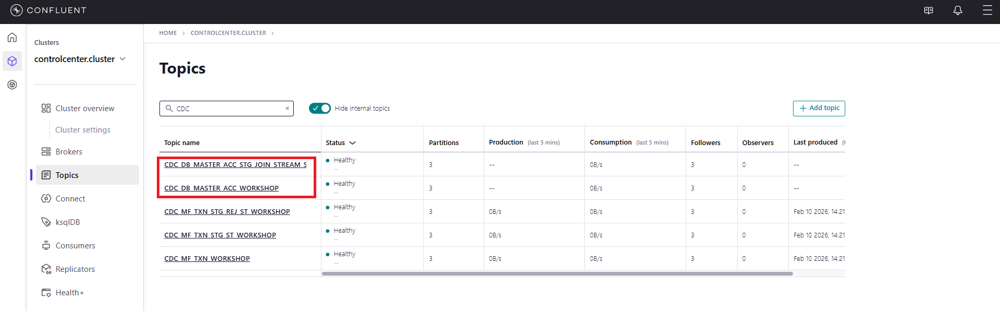
</p>

---

#### Step 3 Insert and Select Data within window time

```sql
-- Insert Data 
INSERT INTO
INSERT INTO
INSERT INTO
```

```sql
SET 'auto.offset.reset' = 'earliest';

-- Select Accept Data 
SELECT * FROM CDC_DB_MASTER_ACC_STG_JOIN_STREAM_STREAM_ST_<USER>
```
#### Output: Verify that normal transactions appear in the accepted stream and rejected transactions appear in the reject stream

- `TXN2001` appears in the joined stream because:
  - It has a matching `ACCOUNT_ID` in the account stream, and
  - The transaction and account records arrive within the 30-second join window,
  - The timing can be verified using the `CURRENT_TIME` column.

- `TXN2002` does **not appear** in the joined stream because:
  - There is no matching `ACCOUNT_ID` in the account stream, **or**
  - The transaction arrives outside the 30-second join window,
  - This can also be confirmed by checking the `CURRENT_TIME` column.

<p align="center">
  
</p>
---

### Pipeline 2.2: Enrichment Stream with Table 
#### Step 1 Create source Table
```SQL
CREATE STREAM CDC_DB_MASTER_ACC_RAW_TB_<USER> (
  ACCOUNT_ID VARCHAR PRIMARY KEY,
  ACCOUNT_NAME VARCHAR,
  ACCOUNT_BALANCE DOUBLE,
  ACCOUNT_TYPE VARCHAR,
  UPDATE_TS TIMESTAMP,
  __OP STRING
) WITH (
  KAFKA_TOPIC = 'CDC_DB_MASTER_ACC_<USER>',  -- Source Kafka topic
  FORMAT = 'JSON',               -- JSON message format
  PARTITIONS = 3,                -- Number of partitions for scalability
  REPLICAS = 3                   -- Replication factor for fault tolerance
);
```
#### Output:
---

#### Step 2 Enrichment Stream with Table

```SQL
CREATE STREAM CDC_DB_MASTER_ACC_STG_JOIN_STREAM_TABLE_ST_<USER> WITH (
  KAFKA_TOPIC = 'CDC_DB_MASTER_ACC_STG_JOIN_STREAM_TABLE_ST_<USER>',      -- Source Kafka topic
  FORMAT = 'JSON',               -- JSON message format
  PARTITIONS = 3,                -- Number of partitions for scalability
  REPLICAS = 3                   -- Replication factor for fault tolerance
) AS 
SELECT 
    A.STRUCT_KEY AS JOIN_KEY,
    T.TXN_ID AS TXN_ID,
    T.TXN_CODE AS TXN_CODE,
    T.TXN_AMT AS TXN_AMT,
    T.ACCOUNT_ID AS ACCOUNT_ID,
    A.ACCOUNT_NAME AS ACCOUNT_NAME,
    A.ACCOUNT_TYPE AS ACCOUNT_TYPE,
    A.ACCOUNT_BALANCE AS ACCOUNT_BALANCE
FROM CDC_MF_TXN_STG_ST_<USER> T
LEFT JOIN CDC_DB_MASTER_ACC_RAW_ST_<USER> A    
ON T.ACC_NO = A.ACCOUNT_ID;
```
#### Step 3 Insert and Select Data

```sql
-- Insert Data 
INSERT INTO
INSERT INTO
INSERT INTO
```

```sql
SET 'auto.offset.reset' = 'earliest';

-- Select Accept Data 
SELECT * FROM CDC_DB_MASTER_ACC_STG_JOIN_STREAM_STREAM_ST_<USER>
```
#### Output:
---
#### Step 4 Insert and Select Data

```sql
-- Insert Data 
INSERT INTO
INSERT INTO
INSERT INTO
```

```sql
SET 'auto.offset.reset' = 'earliest';

-- Select Accept Data 
SELECT * FROM CDC_DB_MASTER_ACC_STG_JOIN_STREAM_STREAM_ST_<USER>
```
#### Output:

---

### Pipeline 2.3: Enrichment Table with Table 
#### Step 1 Create source Table

``` SQL
CREATE TABLE CDC_MF_TXN_STG_PREP_JOIN_TB_<USER> WITH (
    KAFKA_TOPIC = 'CDC_MF_TXN_STG_PREP_JOIN_<USER>',   -- Source Kafka topic
    VALUE_FORMAT = 'JSON',               -- JSON message format
    PARTITIONS = 3,                      -- Number of partitions for scalability
    REPLICAS = 3                         -- Replication factor for fault tolerance
) AS
SELECT
    ACC_NO AS ACC_NO,
    LATEST_BY_OFFSET(TXN_ID) AS TXN_ID,
    LATEST_BY_OFFSET(TXN_TYPE) AS TXN_TYPE,
    LATEST_BY_OFFSET(TXN_AMT) AS TXN_AMT,
    LATEST_BY_OFFSET(TXN_DT) AS TXN_DT
FROM CDC_MF_TXN_STG_ST_<USER>
GROUP BY ACC_NO;
```


#### Step 2 Enrichment Account Table with Transaction Table
```SQL
CREATE TABLE CDC_DB_MASTER_ACC_STG_JOIN_TABLE_TABLE_ST_<USER> WITH (
  KAFKA_TOPIC = 'CDC_DB_MASTER_ACC_STG_JOIN_TABLE_TABLE_<USER>',      -- Source Kafka topic
  FORMAT = 'JSON',               -- JSON message format
  PARTITIONS = 3,                -- Number of partitions for scalability
  REPLICAS = 3                   -- Replication factor for fault tolerance
) AS
SELECT
    A.ACCOUNT_ID,
    A.ACCOUNT_NAME,
    A.ACCOUNT_TYPE,
    T.LATEST_TXN_ID,
    T.LATEST_TXN_AMT,
    T.LAST_TXN_TIME
FROM CDC_MF_TXN_STG_PREP_JOIN_TB_<USER> T
LEFT JOIN CDC_DB_MASTER_ACC_RAW_TB_<USER> A 
ON T.ACC_NO = A.ACCOUNT_ID;
```
#### Step 3 Insert and Select Data

```sql
-- Insert Data 
INSERT INTO
INSERT INTO
INSERT INTO
```

```sql
SET 'auto.offset.reset' = 'earliest';

-- Select Accept Data 
SELECT * FROM CDC_DB_MASTER_ACC_STG_JOIN_TABLE_TABLE_ST_<USER>
```
#### Output:
---
#### Step 4 Insert and Select Data

```sql
-- Insert Data 
INSERT INTO
INSERT INTO
INSERT INTO
```

```sql
SET 'auto.offset.reset' = 'earliest';

-- Select Accept Data 
SELECT * FROM CDC_DB_MASTER_ACC_STG_JOIN_TABLE_TABLE_ST_<USER>
```
#### Output:
---

### Pipeline 3: Aggregation and Window time

#### Basic window type on ksqlDB
<p align="center">
  
</p>
<p align="center">
  <small><em>
    Visualization of Tumbling, Hopping, and Session windows showing how events are grouped over time in ksqlDB.
  </em></small>
</p>
<br>
<div align="center">
  
| Window Type     | Behavior       | Description                                      |
|-----------------|----------------|--------------------------------------------------|
| Tumbling Window | Time-based     | Fixed-duration, non-overlapping, gap-less windows |
| Hopping Window  | Time-based     | Fixed-duration, overlapping windows              |
| Session Window  | Session-based  | Dynamically-sized, non-overlapping, data-driven windows |

</div>

#### Step 1 Create source stream
```SQL
CREATE STREAM MB_LOGIN_EVENTS_RAW_ST_<USER> (
    USER_ID VARCHAR KEY,
    DEVICE_TYPE VARCHAR, -- iOS, Android, Web
    LOGIN_STATUS VARCHAR -- SUCCESS, FAIL
) WITH (
  KAFKA_TOPIC = 'MB_LOGIN_EVENTS_RAW_ST_<USER>',      -- Source Kafka topic
  FORMAT = 'JSON',               -- JSON message format
  PARTITIONS = 3,                -- Number of partitions for scalability
  REPLICAS = 3                   -- Replication factor for fault tolerance
);
```

#### Step 2 Create Aggregation data with Tumbling window
```SQL
CREATE TABLE MB_LOGIN_EVENTS_STG_TUMBLING_ST_<USER> WITH (
    KAFKA_TOPIC = 'BAAC_AGG_LOGIN_TUMBLING_<USER>',      -- Source Kafka topic
    FORMAT = 'JSON',               -- JSON message format
    PARTITIONS = 3,                -- Number of partitions for scalability
    REPLICAS = 3                   -- Replication factor for fault tolerance
) AS
SELECT
    USER_ID,
    COUNT(*) AS LOGIN_COUNT,
    TIMESTAMPTOSTRING(WINDOWSTART, 'HH:mm:ss', 'UTC+7') AS START_TIME,
    TIMESTAMPTOSTRING(WINDOWEND, 'HH:mm:ss', 'UTC+7') AS END_TIME
FROM MB_LOGIN_EVENTS_RAW_ST_<USER>
WINDOW TUMBLING (SIZE 30 SECONDS)
GROUP BY USER_ID;
```
#### Step 3 Insert and Select Data

```sql
-- Insert Data 
INSERT INTO
INSERT INTO
INSERT INTO
```

```sql
SET 'auto.offset.reset' = 'earliest';

-- Select Accept Data 
SELECT * FROM BAAC_AGG_LOGIN_TUMBLING_TB_<USER>
```

#### Step 4 Create Aggregation data with Hopping window
```SQL
CREATE TABLE MB_LOGIN_EVENTS_STG_HOPPING_TB_<USER> WITH (
    KAFKA_TOPIC = 'MB_LOGIN_EVENTS_STG_HOPPING_<USER>',      -- Source Kafka topic
    FORMAT = 'JSON',               -- JSON message format
    PARTITIONS = 3,                -- Number of partitions for scalability
    REPLICAS = 3                   -- Replication factor for fault tolerance
) AS
SELECT
    USER_ID,
    COUNT(*) AS LOGIN_COUNT,
    TIMESTAMPTOSTRING(WINDOWSTART, 'HH:mm:ss', 'UTC+7') AS START_TIME,
    TIMESTAMPTOSTRING(WINDOWEND, 'HH:mm:ss', 'UTC+7') AS END_TIME
FROM MB_LOGIN_EVENTS_RAW_ST_<USER>
WINDOW HOPPING (SIZE 30 SECONDS, ADVANCE BY 10 SECONDS)
GROUP BY USER_ID;
```

#### Step 5 Insert and Select Data

```sql
-- Insert Data 
INSERT INTO
INSERT INTO
INSERT INTO
```

```sql
SET 'auto.offset.reset' = 'earliest';

-- Select Accept Data 
SELECT * FROM MB_LOGIN_EVENTS_STG_HOPPING_TB_<USER>
```

#### Step 6 Create Aggregation data with Session window
```SQL
CREATE TABLE MB_LOGIN_EVENTS_STG_SESSION_TB_<USER> WITH (
    KAFKA_TOPIC = 'MB_LOGIN_EVENTS_STG_SESSION_<USER>',    -- Source Kafka topic
    FORMAT = 'JSON',               -- JSON message format
    PARTITIONS = 3,                -- Number of partitions for scalability
    REPLICAS = 3                   -- Replication factor for fault tolerance
) AS
SELECT
    USER_ID,
    COUNT(*) AS LOGIN_COUNT,
    TIMESTAMPTOSTRING(WINDOWSTART, 'HH:mm:ss', 'UTC+7') AS START_TIME,
    TIMESTAMPTOSTRING(WINDOWEND, 'HH:mm:ss', 'UTC+7') AS END_TIME
FROM BAAC_RAW_LOGIN_EVENTS_ST
WINDOW SESSION (30 SECONDS)
GROUP BY USER_ID;
```

#### Step 7 Insert and Select Data

```sql
-- Insert Data 
INSERT INTO
INSERT INTO
INSERT INTO
```

```sql
SET 'auto.offset.reset' = 'earliest';

-- Select Accept Data 
SELECT * FROM MB_LOGIN_EVENTS_STG_SESSION_TB_<USER>
```


## Operations & Monitoring
### Logging

Logging can be configured using Log4j to store logs in local files for easier monitoring and troubleshooting.  
It allows users to control log levels and formats, save logs for analysis, investigate query failures and system issues, and manage disk usage through log rotation.


### Error handling
Monitor record-level failures through the `ksqldb-processing-log` Kafka topic, as ksqlDB provides built-in error handling and does not require any additional error-handling code. All processing errors can be reviewed through this topic or via local ksqlDB log files.

### Monitoring
#### Confluent Control Center

Confluent Control Center can be used to check the basic status of Kafka and ksqlDB components.  
It also allows users to monitor active queries, inspect topics, and execute SQL commands directly through the Control Center interface.

<p align="center">
  
</p>
<p align="center">
  <small><em>
    ksqlDB Editor for executing SQL statements and viewing query results.
  </em></small>
</p>
<br>

<p align="center">
  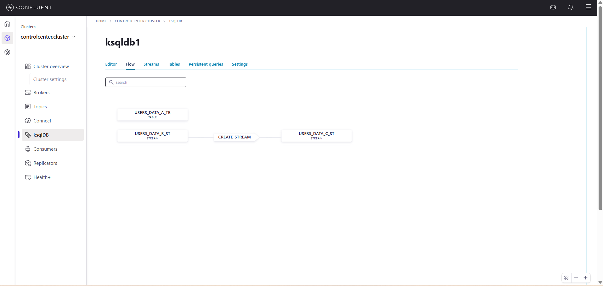
</p>
<p align="center">
  <small><em>
    Flow view showing data lineage between streams and tables.
  </em></small>
</p>
<br>

<p align="center">
  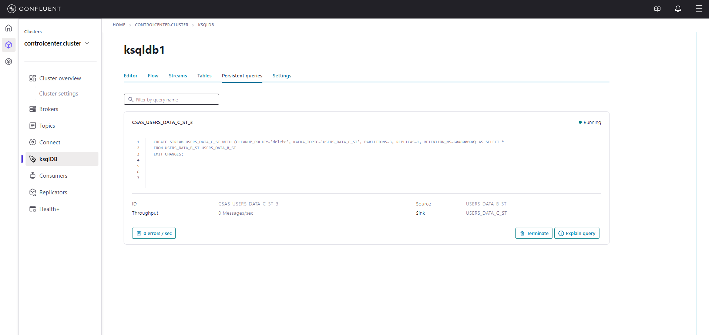
</p>
<p align="center">
  <small><em>
    Persistent query status and execution details in Confluent Control Center.
  </em></small>
</p>
<br>

#### 3rd-Party Visualization Tools

ksqlDB metrics can be exported using third-party tools to scrape and collect data from ksqlDB servers.  
These metrics can be visualized in external monitoring dashboards to monitor system health, query performance, and processing status in real time.


<p align="center">
  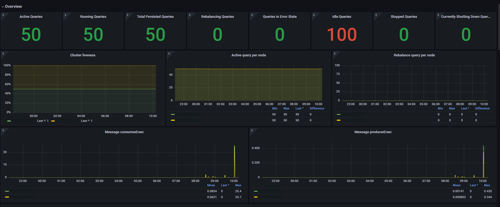
</p>
<p align="center">
  <small><em>
    Overview dashboard showing overall ksqlDB query status, throughput, and cluster health.
  </em></small>
</p>
<br>

<p align="center">
  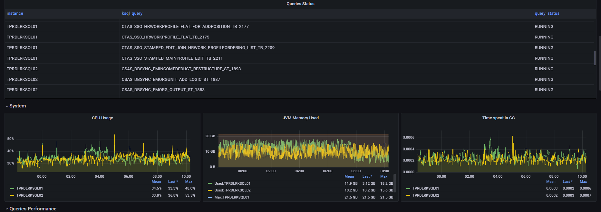
</p>
<p align="center">
  <small><em>
    System and query status dashboard displaying CPU usage, JVM memory, GC activity, and running queries.
  </em></small>
</p>
<br>

<p align="center">
  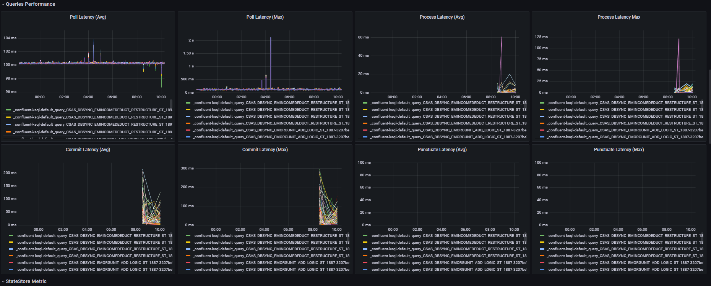
</p>
<p align="center">
  <small><em>
    Query performance dashboard showing poll, process, commit, and punctuate latency metrics.
  </em></small>
</p>
<br
